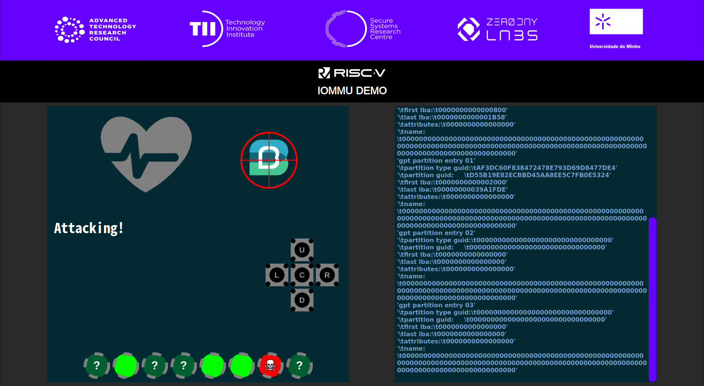

# demo_rvsummit_23
RISC-V IOMMU Demo for the RISC-V Summit 2023

<!-- Table of contents -->
<!-- License -->
<!-- About this project -->
<!-- Interfaces -->
<!-- Usage -->
<!-- Features -->
<!-- Testing -->
<!-- Roadmap -->

## Table of Contents

- [License](#license)
- [About this Repository](#about-this-repository)
- [Dependencies](#dependencies)
- [Usage](#usage)

***

## License

This work is licensed under the Apache-2.0 License. See the [LICENSE](./LICENSE) file for details.

## About this Repository



RISC-V IOMMU Demo for the RISC-V Summit 2023, presented in the [Technology Innovation Institute (TII)](https://www.tii.ae/) booth.

It consists of a game similar to the russian roulette, in which a DMA device is programmed to write zeros into critical memory regions of a single-core CVA6-based platform executing Bao hypervisor and one baremetal guest atop of it. The demo is carried out in a Genesys2 FPGA board. The user navigates through the demo using the five push buttons in the board.

An Input/Output Memory Management Unit (IOMMU) is integrated into the platform. It is enabled by default, but can be disabled using one of the eight switches in the board. However, the lethal switch is selected randomly on every attack. The user can iterate eight times trying switches individually to find the lethal one, or enable multiple switches in a single attack.

The user can select between two targets: [OpenSBI](https://github.com/riscv-software-src/opensbi) and [Bao hypervisor](https://github.com/bao-project/bao-hypervisor). The lethal attack will take down the system in both options.


## **Dependencies**

### Functional code
To compile Bao hypervisor with the baremetal guest and OpenSBI, you need the `riscv64-unknown-elf-` and `riscv64-unknown-linux-gnu-` toolchains installed and added to your `$PATH`.

You can download them from the following links:
- [riscv64-unknown-elf- 10.1.0 2020.08.2](https://static.dev.sifive.com/dev-tools/freedom-tools/v2020.08/riscv64-unknown-elf-gcc-10.1.0-2020.08.2-x86_64-linux-ubuntu14.tar.gz)

- [riscv64-unknown-linux-gnu-](https://github.com/riscv-collab/riscv-gnu-toolchain/releases/tag/2021.08.11)

### GUI
In order to run the Graphical User Interface of the demo, you need to install the following python packages:

- PyQt5 v5.15.9
- pyserial v3.5

To install these packages:
```
python3 -m pip install PyQt5
python3 -m pip install pyserial
```

You may have issues trying to install these packages due to the version of **pip**. If it is the case, update **pip** before installing the packages:
```
pip install --upgrade pip 
```

## **Usage**

### Generating the binary file
To compile Bao with the baremetal guest and OpenSBI, ensure you have initialized all required submodules. In the top directory of the repo, run:
```
git submodule update --init --recursive bao-hypervisor opensbi
```
Then, to compile all sources, run in the top directory of the repository:
```
./build_all
```
All output files will be in the `output` directory.

### Copying to the SD Card
To copy the binary file to the SD card:
1. ***Carefully***, identify the dev file associated to your SD Card (e.g., /dev/sda, /dev/mmcblk).
```
sudo fdisk -l
```

2. Format the SD card. Replace *\<dev_file\>* with the dev file you identfied in step 1. 
```
sudo sgdisk --clear --new=1:2048:7000 --new=2 --typecode=1:3000 --typecode=2:8300 <dev_file> -g
```
:information_source: To speed up the loading of the image, the BOOT (first) partition of the SD card is formatted to just the right size to store the binary file (~2.42 MiB).

3. Copy the binary file to the SD card. Again, replace *\<dev_file\>* with the dev file you identfied in step 1. 
```
sudo dd if=output/fw_payload.bin of=<dev_file> oflag=sync bs=1M
```

### Configuring the Genesys2 board
Insert the SD Card with the binary file into the Genesys2 board.

The bitstream required for the demo is already stored in the flash memory of the board. Thus, after turning on the board, wait for the **DONE** led to be ON, and press the **PROG** push button to load the bitstream.

Wait for the **DONE** led to be ON again, and then press the **RESET** push button. The board will start loading the image from the SD card. This takes approximately 20 seconds.

:information_source: If for some reason you need to program the FPGA through the JTAG interface using Vivado, the bitstream is located in  `fpga/ariane_xilinx.bit`.

:information_source: This demo ends with the crashing of the system. After configuring the FPGA board, you only need to press the **RESET** button to restart. 

### Running the GUI
To execute the GUI application, run:
```
python3 gui/main.py <serial_port>
```
Where `<serial_port>` is the label of the serial port connected to the FPGA board (e.g., /dev/ttyUSB0).